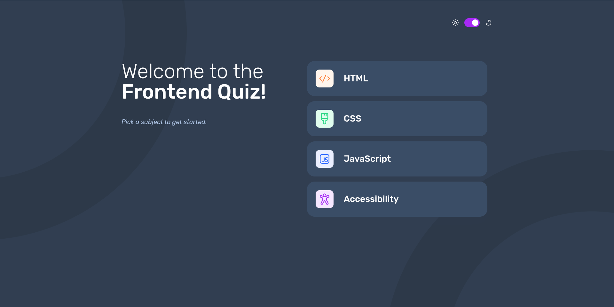

# Frontend Mentor - Frontend quiz app solution

This is a solution to
the [Frontend quiz app challenge on Frontend Mentor](https://www.frontendmentor.io/challenges/frontend-quiz-app-BE7xkzXQnU).
Frontend Mentor challenges help you improve your coding skills by building realistic projects.

## Table of contents

- [Overview](#overview)
    - [The challenge](#the-challenge)
    - [Screenshot](#screenshot)
    - [Links](#links)
- [My process](#my-process)
    - [Built with](#built-with)
    - [What I learned](#what-i-learned)
    - [Continued development](#continued-development)

## Overview

### The challenge

Users should be able to:

- Select a quiz subject
- Select a single answer from each question from a choice of four
- See an error message when trying to submit an answer without making a selection
- See if they have made a correct or incorrect choice when they submit an answer
- Move on to the next question after seeing the question result
- See a completed state with the score after the final question
- Play again to choose another subject
- View the optimal layout for the interface depending on their device's screen size
- See hover and focus states for all interactive elements on the page
- Navigate the entire app only using their keyboard
- **Bonus**: Change the app's theme between light and dark

### Screenshot

### Links

- Solution
  URL: [https://github.com/async-kita/front-end-quiz-app/tree/main](https://github.com/async-kita/front-end-quiz-app/tree/main)
- Live Site URL: [https://async-kita.github.io/front-end-quiz-app/](https://async-kita.github.io/front-end-quiz-app/)

## My process

### Built with

- Semantic HTML5 markup
- CSS custom properties
- Flexbox
- CSS Grid
- Mobile-first workflow
- React - JS library
- CSS Modules for component‑scoped styling
- Custom useTheme hook with localStorage persistence

### What I learned

This project deepened my understanding of state management in React without external libraries. I handled multiple UI
states (selection, correct/incorrect answer, error, final score) using just useState. The custom useTheme hook was a
great exercise in side effects and localStorage.

### Continued development

In future projects I want to focus on:

- Replacing multiple useState calls with useReducer for more predictable state transitions.
- Adding unit tests (React Testing Library) for the quiz logic and theme toggle.
- Improving accessibility further, for example by managing focus when moving between questions.
